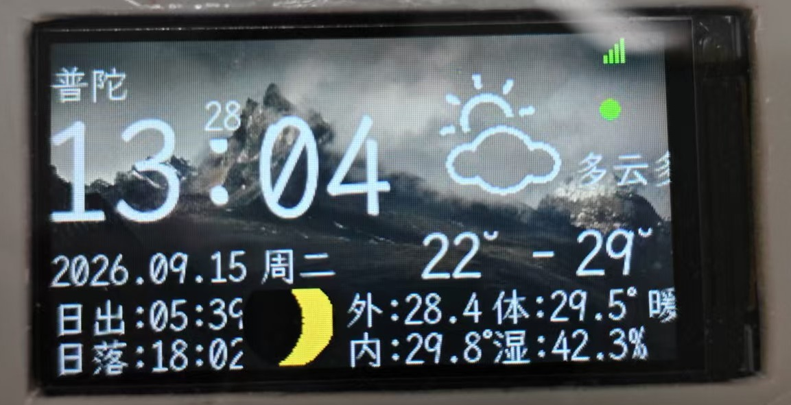
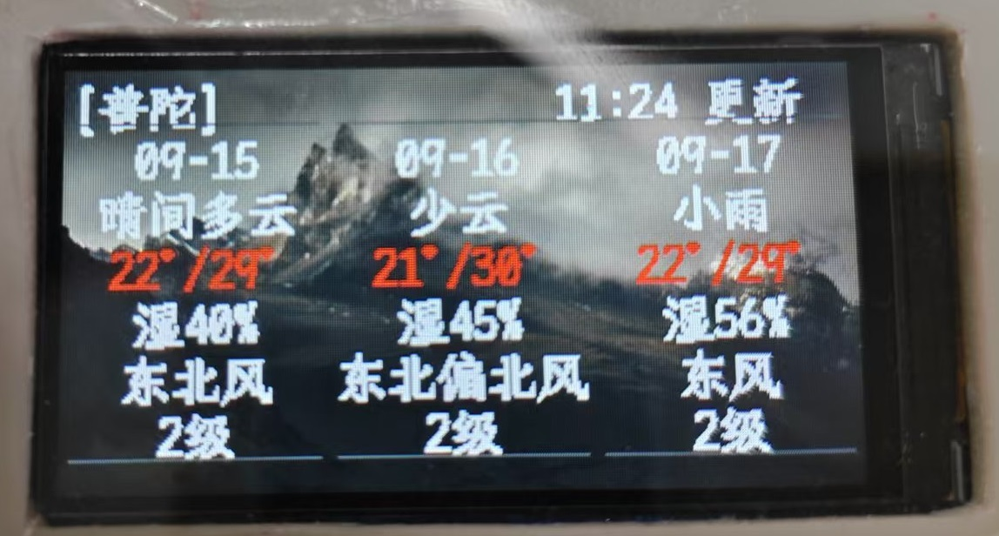
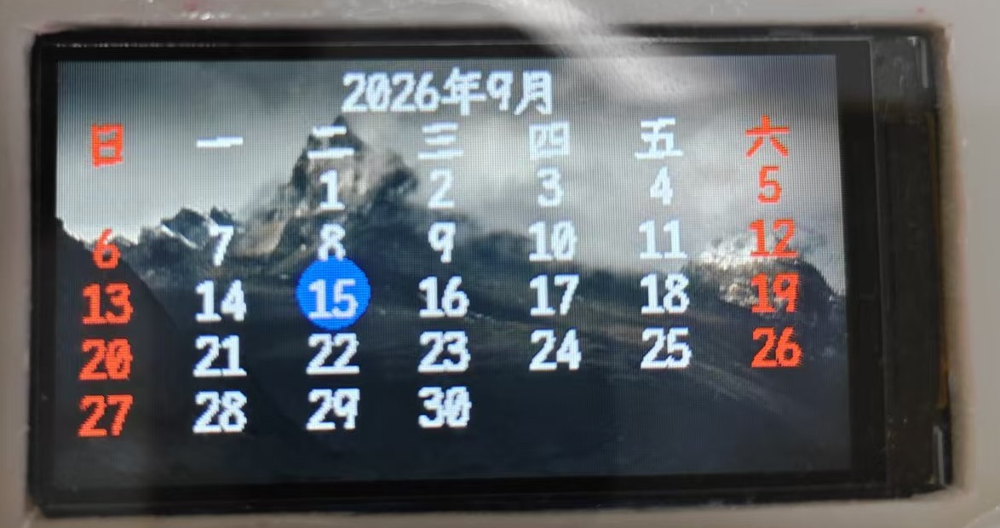
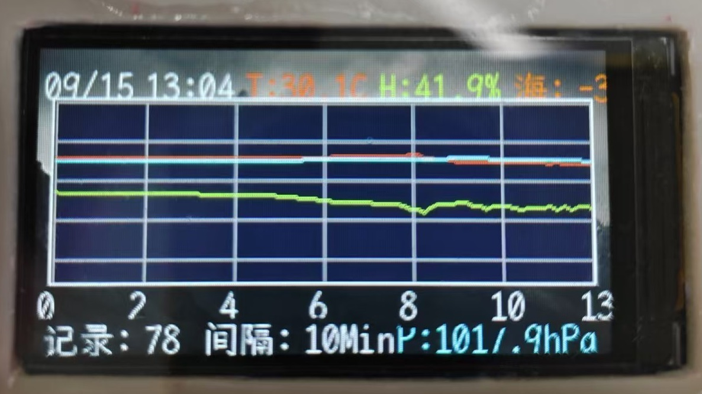
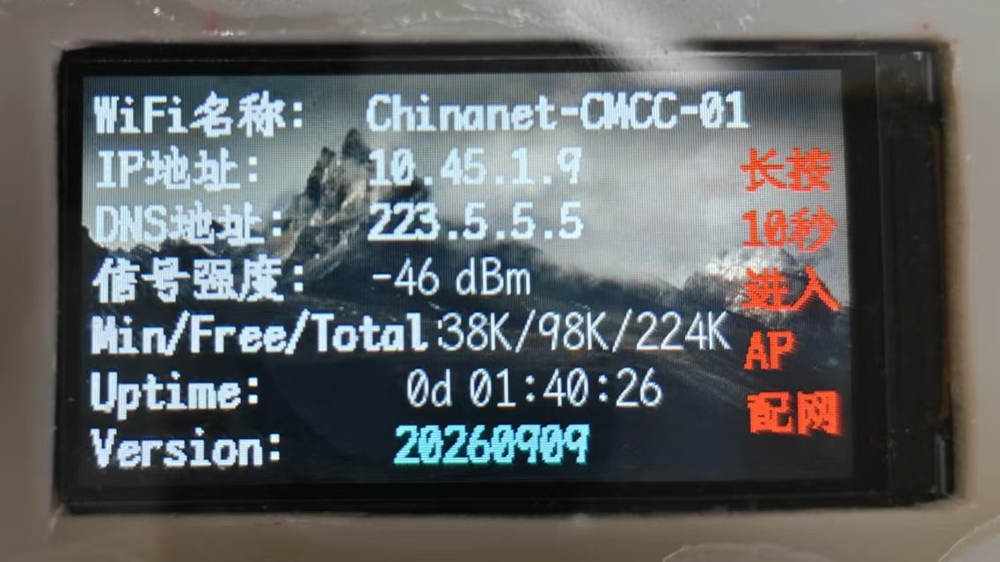
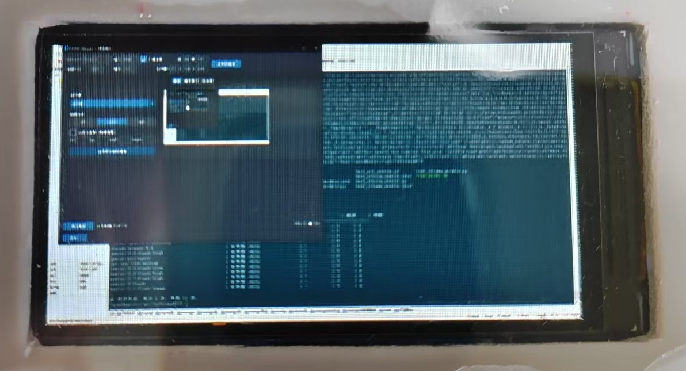
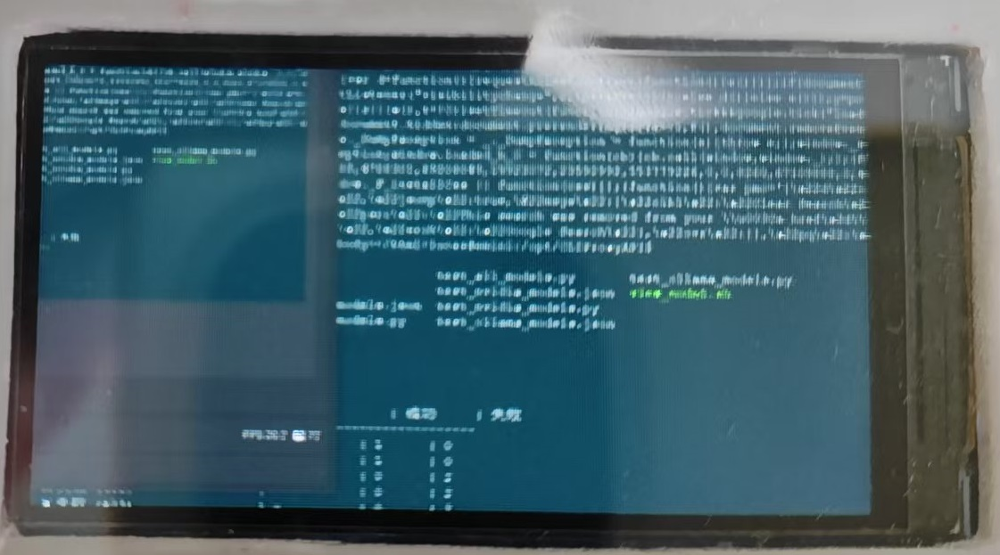
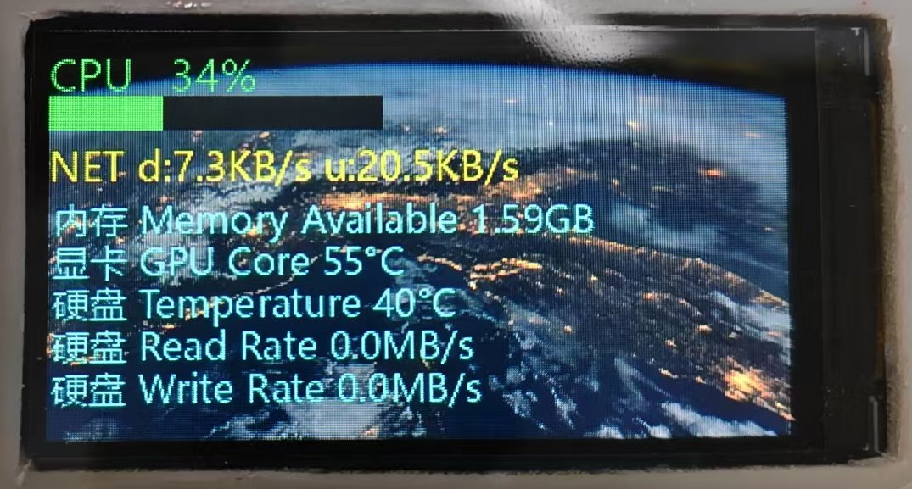
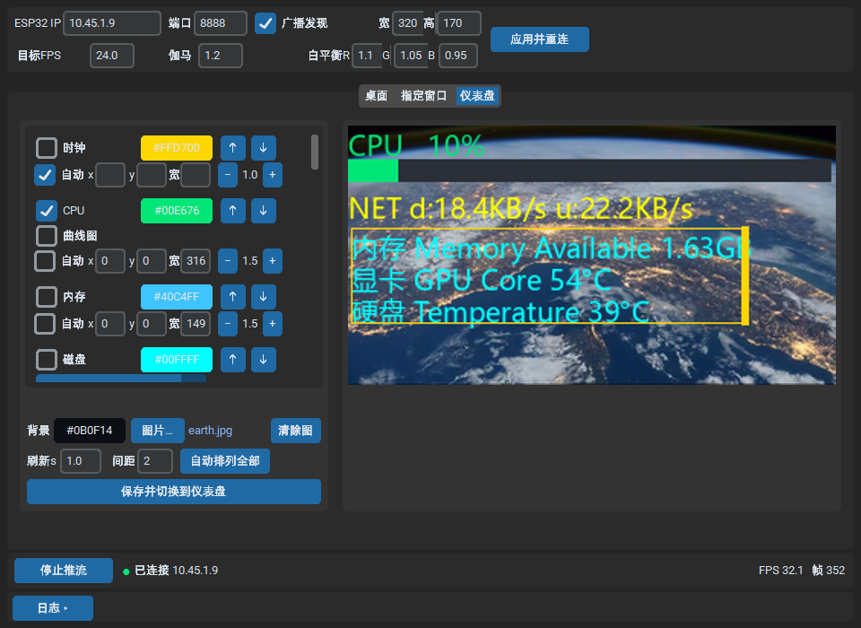

# ESP32-C3 智能天气时钟

基于 ESP32-C3 的智能天气时钟项目，集成环境监测、屏幕显示、WiFi通信和屏幕流传输等功能。

## 功能展示

### 设备端页面

| 温度主页 | 3天天气预报 |
| :---: | :---: |
|  |  |
| 时间、天气、温湿度、月相、日出日落 | 日期、天气、温度、湿度、风向风力 |

| 月历 | 历史曲线 |
| :---: | :---: |
|  |  |
| 月历视图，当日高亮 | 温湿度、气压曲线（每10分钟采样） |

| WiFi 信息 | 屏幕流 - 桌面投屏 |
| :---: | :---: |
|  |  |
| 连接状态、IP、信号强度、内存 | PC 桌面画面实时投屏 |

| 屏幕流 - 窗口投屏 | 屏幕流 - 仪表盘 |
| :---: | :---: |
|  |  |
| 指定窗口画面投屏 | CPU / 内存 / 网络 / 显卡 / 硬盘系统监控 |

### PC 端流媒体服务器



PC 端流媒体服务器（[Python-ESP32-Streaming](tools/Python-ESP32-Streaming/)），支持桌面、指定窗口、仪表盘三种推送模式，可自由拖拽布局系统监控小组件。

## 硬件平台

- **主控**: ESP32-C3 (合宙 CORE ESP32C3)
- **显示屏**: ST7789 320×170 TFT 屏幕 (SPI 接口)
- **传感器**: AHT20+BMP280 (温湿度+气压 I2C传感器)
- **触摸**: TTP223 电容触摸传感器
- **LED**: 状态指示灯（WiFi未连接时快速闪烁，正常运行时关闭）
- **蜂鸣器**: 有源蜂鸣器（低电平触发，初始化后保持高电平静音状态）

## GPIO 引脚配置

以下引脚配置基于 **合宙 CORE ESP32C3** 板型（`BOARD_AIRM2M_CORE_ESP32C3`），定义在 [config.h](include/config.h) 和 [platformio.ini](platformio.ini) 中：

| GPIO 编号    | 功能        | 说明        | 方向            | 所属模块         |
| ---------- | --------- | --------- | ------------- | ------------ |
| **GPIO0**  | TFT\_CS   | 屏幕片选信号    | OUTPUT        | ST7789 TFT   |
| **GPIO1**  | TFT\_DC   | 屏幕数据/命令选择 | OUTPUT        | ST7789 TFT   |
| **GPIO2**  | TFT\_RST  | 屏幕复位信号    | OUTPUT        | ST7789 TFT   |
| **GPIO3**  | TFT\_MOSI | 屏幕SPI数据线  | OUTPUT        | ST7789 TFT   |
| **GPIO4**  | TFT\_SCLK | 屏幕SPI时钟线  | OUTPUT        | ST7789 TFT   |
| **GPIO5**  | TFT\_BL   | 屏幕背光控制    | OUTPUT (LEDC) | ST7789 TFT   |
| **GPIO6**  | I2C\_SCL  | I2C时钟线    | OUTPUT        | AHT20+BMP280 |
| **GPIO7**  | I2C\_SDA  | I2C数据线    | IN/OUT        | AHT20+BMP280 |
| **GPIO8**  | BUZZER    | 蜂鸣器控制     | OUTPUT (LEDC) | 有源蜂鸣器        |
| **GPIO10** | TOUCH     | 触摸传感器输入   | INPUT\_PULLUP | TTP223       |
| **GPIO12** | LED\_D4   | 状态指示灯     | OUTPUT        | LED          |
| **GPIO13** | LED\_D5   | 备用LED     | OUTPUT        | LED          |

### 引脚详细说明

#### TFT 屏幕 (SPI)

- **GPIO0 (TFT\_CS)**: 低电平选中屏幕，高电平释放
- **GPIO1 (TFT\_DC)**: 高电平传输数据，低电平传输命令
- **GPIO2 (TFT\_RST)**: 低电平复位屏幕，初始化后保持高电平
- **GPIO3 (TFT\_MOSI)**: SPI主机输出/从机输入数据
- **GPIO4 (TFT\_SCLK)**: SPI时钟信号，最高40MHz
- **GPIO5 (TFT\_BL)**: 背光亮度控制，使用LEDC PWM调光（4档亮度）

#### I2C 传感器

- **GPIO6 (I2C\_SCL)**: I2C时钟线，标准400kHz速率
- **GPIO7 (I2C\_SDA)**: I2C数据线，双向传输

#### 其他外设

- **GPIO8 (BUZZER)**: 蜂鸣器控制，低电平触发发声，使用LEDC产生音调
- **GPIO10 (TOUCH)**: 电容触摸传感器，上拉输入，触摸时为低电平
- **GPIO12 (LED\_D4)**: 主状态指示灯，WiFi未连接时快速闪烁
- **GPIO13 (LED\_D5)**: 备用LED，当前未使用

## 项目结构

```
esp32_time_weather/
├── src/                    # 主程序源码
│   ├── main.cpp            # 主入口，非阻塞循环（触摸、显示、LED、报时、亮度）
│   ├── TaskManager.cpp     # FreeRTOS任务管理器（WiFi、时间同步、天气、传感器、历史、时间显示）
│   ├── PageManager.cpp     # 页面管理器
│   ├── DisplayManager.cpp  # 显示管理器（背景、字体）
│   ├── WiFiManager.cpp     # WiFi 连接管理（含 Web 配网 + ESP-Touch SmartConfig + SPIFFS文件管理）
│   ├── WeatherManager.cpp  # 和风天气 API 调用
│   ├── TimeManager.cpp     # NTP 时间同步
│   ├── AHT20BMP280Sensor.cpp # AHT20+BMP280 传感器驱动
│   ├── TTP223Sensor.cpp    # 触摸传感器驱动
│   ├── LEDController.cpp   # LED 控制
│   ├── *Page.cpp           # 各页面实现
│   └── secrets.cpp         # 敏感信息（JWT私钥等，需自行创建）
├── include/                # 头文件
│   ├── config.h            # 引脚、WiFi、更新间隔配置（需自行创建）
│   ├── secrets.h           # 敏感信息声明（extern）
│   ├── TaskManager.h       # 任务管理器接口
│   ├── PageManager.h       # 页面枚举定义
│   ├── PageBase.h          # 页面基类
│   ├── bg2.h~bg6.h, bg8.h~bg9.h  # 背景图（RGB565 数组）
│   └── font_*.h            # 自定义字体
├── Python-ESP32-Stream/    # PC 端屏幕流服务器
│   ├── client.py           # 主服务器入口
│   ├── pipeline.py         # 帧处理管道
│   ├── window_capture.py   # 窗口捕获
│   ├── view_window_title.py # 查看可见窗口标题工具
│   ├── config.yaml         # 配置文件
│   └── requirements.txt    # Python 依赖
├── platformio.ini          # PlatformIO 构建配置
└── partitions.csv          # Flash 分区表
```

## 页面功能

| 页面               | 名称     | 功能                                                                                                 |
| ---------------- | ------ | -------------------------------------------------------------------------------------------------- |
| PAGE\_TEMP       | 温度页面   | 显示时间、日期、温度、湿度、天气图标、**月相图标**（QWeather `moonPhaseIcon` 字段，48×48 月光黄）                                 |
| PAGE\_FORECAST   | 天气预报   | 3天天气预报（**3 卡片 7 行布局**：日期、天气、温度、湿度、**风向 + 风力 2 行**）                                                 |
| PAGE\_CALENDAR   | 日历     | 月历视图                                                                                               |
| PAGE\_PRESSURE   | 气压页面   | 气压显示、气压预警（骤降触发）                                                                                    |
| PAGE\_HISTORY    | 历史页面   | 温湿度、气压曲线图（每10分钟采样）                                                                                 |
| PAGE\_WIFI\_INFO | WiFi信息 | 连接状态、SSID、IP、信号强度                                                                                  |
| PAGE\_AP\_MODE   | AP配网   | 启动时WiFi连接失败自动进入，或长按10秒进入，提供WiFi配置门户（显示已保存WiFi列表），同时支持 ESP-Touch SmartConfig 蓝牙配网；**10 分钟倒计时后自动退出** |
| PAGE\_STREAMING  | 屏幕流    | 接收PC端屏幕流实时显示（**全中文错误提示**）                                                                          |
| <br />           | <br /> | <br />                                                                                             |

## 交互方式

| 操作          | 效果                                            |
| ----------- | --------------------------------------------- |
| **短按触摸**    | 切换到下一个页面（AP\_MODE 页面**短按直接返回 TempPage** 退出配网） |
| **双击触摸**    | 切换到上一个页面（AP\_MODE 页面**双击也返回 TempPage** 退出配网）  |
| **长按10秒以上** | 进入AP配网模式                                      |

> **AP\_MODE 退出机制**: 在 AP 配网页面下，短按或双击触摸会直接退出到 TempPage（不是切换到下一个/上一个页面），避免误触发屏幕流/翻页时钟等不相关页面。倒计时结束后也会自动调 `stopAPMode()` 退出。详见 [PageManager.cpp#L39-L75](src/PageManager.cpp) 和 [APModePage.cpp#L19-L26](src/APModePage.cpp)。

## 核心特性

- **历史数据**: 每10分钟保存一次传感器数据到 SPIFFS
- **气压预警**: 气压骤降时自动切换到气压页面并警告
- **IP自动定位**: 通过公网IP自动获取所在城市经纬度，仅获取一次，失败时使用默认配置
- **双模式配网**: 启动时WiFi连接失败自动进入配网模式，同时支持两种配网方式：
  - **Web 配网**: 连接 `ESP32-Weather` WiFi热点，通过浏览器访问 `192.168.4.1` 配置WiFi
  - **ESP-Touch SmartConfig**: 使用手机APP（如ESP-Touch、乐鑫官方配网工具）发送WiFi信息，无需手动连接热点
- **屏幕流传输**: 通过TCP接收PC屏幕画面
- **文件管理**: 联网后自动启动WebServer，通过浏览器访问 `http://<ESP32_IP>/fs` 进行SPIFFS文件上传/下载/删除
- **任务管理**: 使用 FreeRTOS 任务管理器统一管理所有阻塞操作（WiFi、时间同步、天气、传感器、历史、时间显示）

## 任务调度

| 任务名             | 核心 | 优先级 | 栈大小      | 调度间隔  |
| --------------- | -- | --- | -------- | ----- |
| TaskWiFi        | 0  | 3   | 4KB      | 100ms |
| TaskTimeSync    | 0  | 4   | 4KB      | 1s    |
| TaskWeather     | 0  | 4   | **16KB** | 1s    |
| **TaskSensors** | 1  | 5   | **4KB**  | 500ms |
| TaskHistory     | 1  | 5   | 4KB      | 1s    |
| TimeDisplay     | 0  | 2   | 8KB      | 100ms |

> **注意**:
>
> - `TaskWeather` 任务栈必须保持 16KB（不是默认 8KB），因为 mbedTLS 握手 + JWT 生成 + HTTPClient 累计栈使用峰值约 4KB，8KB 会在 HTTPS 发起时栈溢出导致 `Guru Meditation Error: Core 0 panic'ed (Store access fault)`。详见 [TaskManager.cpp#L57](src/TaskManager.cpp)。
> - `TaskSensors` 任务栈必须保持 4KB（不是 2KB），因为 `readAHT20()` 和 `readBMP280()` 各有一个 `Serial.printf`，`printf` 内部 `vprintf` 占用 \~1.5KB 栈，两个 printf 累计 \~3KB，2KB 栈使用率达 94.7% 极危险。详见 [TaskManager.cpp#L74](src/TaskManager.cpp)。

## 快速开始

### 1. 复制配置文件

```bash
cp include/config.h.sample include/config.h
cp src/secrets.cpp.sample src/secrets.cpp
```

### 2. 配置 WiFi

编辑 `include/config.h`:

```cpp
#define WIFI_SSID      "YOUR_WIFI_SSID"
#define WIFI_PASS      "YOUR_WIFI_PASSWORD"
```

### 3. 配置和风天气 API

编辑 `src/secrets.cpp`:

```cpp
const char* QWEATHER_HOST = "https://your-re.qweatherapi.com";
const char* LOCATION = "101020600";
const char* JWT_KID = "YOUR_JWT_KID";
const char* JWT_SUB = "YOUR_JWT_SUB";
const char* PRIVATE_KEY = "YOUR_ED25519_PRIVATE_KEY_BASE64";
```

### 4. 编译与上传

```bash
pio run                    # 编译
pio run --target upload    # 编译并上传
pio device monitor         # 打开串口监视器
```

## Python 屏幕流服务器 (`tools/Python-ESP32-Stream`)

PC 端屏幕流服务器位于 [`tools/Python-ESP32-Stream/`](tools/Python-ESP32-Stream/)，通过 TCP 把 PC 屏幕/窗口画面实时推送到 ESP32 屏幕流页面（`PAGE_STREAMING`）。

### 工作原理

- 服务器（`client.py`）启动后会读取 `config.yaml` 中的 pipeline 配置
- 多线程架构：帧生成线程（采集/生成画面）+ 帧消费线程（差分压缩、RGB565 编码、TCP 发送）
- 使用差异更新（dirty rect）+ 自适应阈值，仅发送变化区域，降低带宽
- ESP32 通过 TCP 连接（默认端口 8888），用 `TFT_eSPI.pushImage()` 渲染

### 安装依赖

```bash
cd tools/Python-ESP32-Stream
pip install -r requirements.txt
```

依赖说明（`requirements.txt`）：

- `mss` / `pygetwindow` / `pyrect` / `numba`：跨平台屏幕与窗口捕获
- `Pillow`：图像处理
- `numpy`：颜色校正与差分算法
- `pyyaml`：读取 YAML 配置

### 启动服务器

```bash
cd tools/Python-ESP32-Stream
python client.py
```

启动后会：

1. 加载 `config.yaml` 配置
2. 在配置的 `esp32_port`（默认 8888）监听 TCP 连接
3. 当 ESP32 切换到"屏幕流"页面并主动连接时，开始推送画面
4. 按 `Ctrl+C` 停止

### 配置 (`config.yaml`)

主要配置项：

| 配置项                                                | 说明                  | 默认值                         |
| -------------------------------------------------- | ------------------- | --------------------------- |
| `shared.esp32_host`                                | ESP32 IP 地址（强制配置）   | `10.45.1.9`                 |
| `shared.esp32_port`                                | ESP32 监听端口          | `8888`                      |
| `shared.use_broadcast`                             | 是否启用 UDP 广播发现 ESP32 | `true`                      |
| `pipelines[].target_width/height`                  | 目标屏幕分辨率             | `320×170`                   |
| `pipelines[].image_source_mode`                    | 图像源模式               | `WINDOW_CAPTURE`            |
| `pipelines[].window_title`                         | 要捕获的窗口标题            | `"任务管理器"`                   |
| `default_pipeline_settings.target_fps`             | 目标帧率                | `24.0`                      |
| `default_pipeline_settings.gamma` / `wb_scale`     | 伽马/白平衡校正            | `1.2` / `[1.1, 1.05, 0.95]` |
| `default_pipeline_settings.heartbeat_interval_sec` | 心跳保活间隔              | `2.0`                       |

> **常用工具**：`python view_window_title.py` 可列出当前所有可见窗口的标题，便于填写 `window_title`。

### 使用流程

1. 编辑 `config.yaml`，把 `shared.esp32_host` 改为你的 ESP32 IP（可从 `PAGE_WIFI_INFO` 页面查看）
2. 启动 `python client.py`
3. 在 ESP32 上短按触摸，切换到"屏幕流"页面（`PAGE_STREAMING`）
4. 等待连接成功（页面会显示"正在连接流媒体服务器" → 开始接收画面）

### 常见问题

- **画面卡顿/丢帧**：检查 WiFi 信号；调高 `target_fps`；调高 `max_dirty_rect_threshold`
- **颜色偏色**：调整 `gamma` 与 `wb_scale`
- **连接不上**：确认 `esp32_host` IP 正确、PC 与 ESP32 在同一网段、防火墙放行 8888 端口

更多细节参考 [`tools/Python-ESP32-Stream/README.md`](tools/Python-ESP32-Stream/README.md)。

## 自定义字体生成 (`tools/gen_font_small_20.py`)

[`tools/gen_font_small_20.py`](tools/gen_font_small_20.py) 用于从 TrueType 字体生成 TFT\_eSPI 可用的 `.vlw` 格式字体头文件（`include/font_small_20.h`）。

### 功能

- 从任意 TTF 字体（默认 `LXGWWenKaiMono-Regular.ttf`）按指定字号（默认 20px）渲染字形
- 自动从 [`tools/charset.txt`](tools/charset.txt) 读取要包含的字符（自动跳过空白、去重）
- 自动追加 ASCII 可打印字符（0x20-0x7E）
- 按 TFT\_eSPI `.vlw` 格式（big-endian，28 字节/字形元数据 + alpha 位图）打包
- 输出 C 头文件 `const uint8_t font_small_20[] PROGMEM = {...}`

### 使用方法

#### 1. 准备字符集文件

编辑 [`tools/charset.txt`](tools/charset.txt)，每行写入需要的字符（空格、换行会被自动跳过）：

```
温度单位°天气状态晴多云少间阴夜雨雪雾雷
日期年月日周一二三四五六
城市北京上海深圳广州...
```

#### 2. 准备字体文件

将 TTF 字体放到 `tools/` 目录下，脚本默认加载 `LXGWWenKaiMono-Regular.ttf`。如需更换字体，修改脚本顶部 `FONT_PATH`。

#### 3. 运行脚本

```bash
cd tools
python gen_font_small_20.py
```

输出 `include/font_small_20.h`，运行结束会打印：

```
============================================================
DONE
============================================================
Output file     : .../include/font_small_20.h
C header size   : xxx bytes (xx.xx MB)
VLW binary size : xxx bytes (xx.x KB)
Glyphs          : xxx (ASCII: xx, custom: xx)
```

#### 4. 在 ESP32 代码中使用

```cpp
#include "font_small_20.h"

void setup() {
    tft.loadFont(font_small_20);  // 加载 PROGMEM 中的 .vlw 数据
    tft.setTextColor(TFT_WHITE);
    tft.drawString("你好 ESP32", 0, 0);
}
```

### 配置项

脚本顶部可调整：

| 变量              | 作用         | 默认值                          |
| --------------- | ---------- | ---------------------------- |
| `FONT_PATH`     | TTF 字体文件路径 | `LXGWWenKaiMono-Regular.ttf` |
| `FONT_SIZE`     | 字体大小（像素）   | `20`                         |
| `OUTPUT_H`      | 输出头文件路径    | `include/font_small_20.h`    |
| `CHARSET_FILE`  | 字符集文件路径    | `tools/charset.txt`          |
| `VARIABLE_NAME` | C 数组变量名    | `font_small_20`              |

> **注意**：包含 GB2312 一级汉字（3755 字）时输出约 150-200KB，过大会挤占 Flash。脚本默认从 `charset.txt` 读取精简字符集，按需添加。

## 使用流程

1. **编译上传**: 连接ESP32，执行 `pio run --target upload`
2. **首次启动**: ESP32自动尝试连接已保存的WiFi，如果连接失败则自动进入配网模式（AP热点 + SmartConfig），连接成功后同步NTP时间，拉取天气数据
3. **配网方式**:
   - **Web 配网**: 在手机/电脑上连接 `ESP32-Weather` WiFi热点，浏览器访问 `192.168.4.1` 配置WiFi
   - **ESP-Touch**: 打开ESP-Touch手机APP，输入WiFi信息即可，无需连接热点
4. **正常使用**: 短按触摸切换页面，双击切换到上一页，长按10秒进入配网模式
5. **屏幕流**: 在PC上启动服务器，在ESP32上切换到"屏幕流"页面接收画面
6. **文件管理**: 联网后WebServer自动启动，直接在浏览器访问 `http://<ESP32_IP>/fs`

## 注意事项

- SPIFFS分区大小为0.5MB，注意不要上传太大的文件
- WebServer在联网后自动启动，无需切换页面
- 配网模式（AP热点 + SmartConfig）在以下情况自动进入：首次启动无WiFi配置、WiFi连接失败、长按触摸键10秒以上手动触发，进入后显示10分钟倒计时
- SmartConfig 默认超时时间为2分钟，超时后自动停止，可继续使用 Web 配网
- 历史数据文件（`history_*.dat`）已加入.gitignore，不会被提交

## 依赖库

- TFT\_eSPI - TFT屏幕驱动
- PNGdec - PNG解码
- ArduinoJson - JSON解析
- ArduinoUZlib - gzip解压

## 更新日志

### 2026-07-25

- **新增**: TempPage 月相图标显示
  - QWeather `moonPhaseIcon` 字段（如 `"803"` = 盈凸月）显示在日出日落文字右边
  - 48×48 月光黄 (`#FFFACD`) 月相图，月光色硬边 alpha（阈值 128）
  - 新增 8 个 `data/icon_800-807.png`（moon phase icons from QWeather）
  - 修复 PNGdec 字节序问题：`PNG_RGB565_BIG_ENDIAN` → `PNG_RGB565_LITTLE_ENDIAN`（BIG\_ENDIAN 误用触发 `__builtin_bswap16` 导致非对称颜色显示为字节序反色）
- **优化**: 合并 Python 工具脚本
  - `bg_png_to_data.py` + `bg_to_transparent_png.py` 合并为 [`tools/bg_convert.py`](tools/bg_convert.py)
  - 支持真透明 RGBA 全管道（不调用 `convert('RGB')`）
  - 新增参数：`--width/--height/--screen-size`、`--mode none/soft/hard/contrast`、`--fit cover/contain/stretch`、`--format rgba/palette8`
  - moon 目录批量处理为 48×48 月光黄
- **优化**: 3日天气 ForecastPage 布局
  - 从 6 行扩展到 7 行布局：日期、天气、温度、湿度、**风向（独立 1 行）**、**风力等级（独立 1 行）**
  - 卡片高度 126 → 134px（仍适配 170px 屏幕）
  - 温度用 `COLOR_GOLD_WARM`（项目自定义暖金色），其他文字 `TFT_WHITE`
- **优化**: AP配网页面退出机制
  - 修复 AP\_MODE 页面短按/双击会跳到不相关页面（StreamingPlayerPage/FlipClockPage）的设计缺陷
  - `PageManager::next()/prev()` 在 `_current==PAGE_AP_MODE` 时直接 `switchTo(PAGE_TEMP)`
  - `APModePage::update()` 倒计时 0 时主动 `stopAPMode()` + TaskManager 自动跳回 TempPage
  - 修复 `WiFiManager::checkAPTimeout()` 只在 WiFi 已连接时才被调用的隐藏 bug
- **优化**: StreamingPlayerPage 全中文
  - 所有 `tft.drawString` 和 `snprintf` 用户可见字符串改为中文（"正在连接流媒体服务器" 等）
  - 调试日志（`Serial.println`）保持英文
- **修复**: TaskWeather 栈溢出 (Store access fault)
  - 症状：`Guru Meditation Error: Core 0 panic'ed (Store access fault)` 间歇性崩溃（HTTPS 发起 0.5s 后）
  - 根因：mbedTLS 握手 (3-4KB 内部栈) + JWT 生成 (多个 String + 4 次 base64url malloc 4KB) + HTTPClient 累计栈峰值 6-8KB，8KB 任务栈在临界状态溢出
  - 修复：TaskWeather 任务栈 `8192` → `16384` (16KB)
  - 加 4 个阶段 HWM 监控：< 4KB 时打印 ⚠️ 告警
- **修复**: TaskSensors 栈使用率 94.7% 临界
  - 症状：启动后 `printMemoryUsage` 报告 `TaskSensors : 108 B 剩 / 2048 B 分配 | 用了 ~1940 B (94.7%) ⚠️`
  - 根因：`readAHT20()` + `readBMP280()` 各有一个 `Serial.printf`，Arduino `printf` 内部 `vprintf` 占用 \~1.5KB 栈，两个 printf 累计 \~3KB 加上 I2C 局部变量 + Wire 库 buffer 实际 \~1.9KB，2KB 栈几乎耗尽
  - 修复：TaskSensors 任务栈 `2048` → `4096` (4KB)
- **修复**: mbedTLS SSL 分配失败 (-32512) 间歇性失败
  - 症状：`[ssl_client.cpp:37] _handle_error(): [start_ssl_client():264]: (-32512) SSL - Memory allocation failed`
  - 根因：mbedTLS 强制使用内部 RAM（不能用 PSRAM，Espressif 官方文档确认）+ 动态分配内部 buffer + 多次失败后堆碎片化
  - 修复 5 步：①HTTPS 请求前检查 `getMaxAllocHeap() < 24*1024` 提前放弃；②失败重试间隔 2s → 5s；③重试日志打印 `getFreeHeap + getMaxAllocHeap` 监控碎片程度；④`taskWeather()` 4 个阶段开始前调用 `waitForHeap(24KB, 15s)` lambda 等堆恢复；⑤fetch\* 函数 `retry == 1` 时延长等待 30s 让系统自然回收堆碎片
  - **二次优化#8**：避免"反复重试"循环。重试次数 3→2 + 失败时显式析构 mbedTLS（`~WiFiClientSecure()` + placement new 重建）强制释放 SSL context (32KB)；原"WiFi.disconnect(true)"方案会触发 WiFiManager::maintainConnection() 进入 AP 配网模式循环，已撤掉
  - **关键**：weatherClient 必须在 retry 循环**外**定义，否则 C++ 默认构造会与 placement new 冲突，导致析构时被双重释放
- **优化#10（隐藏 bug 修复）**: `setTimeout` 单位修正（秒 → 毫秒）
  - 之前：`client.setTimeout(5)` 实际是 **5 毫秒**（`setTimeout(uint32_t ms)` 参数是毫秒，不是秒！）
  - 5ms 几乎必定超时 → HTTPS 连接无法建立 → SSL -32512 失败的隐藏根因之一
  - 修复：`client.setTimeout(5000)` = 5 秒 socket 读/写超时
  - 同时强调 `setInsecure()` 的关键作用：禁用证书验证，省掉 mbedTLS 证书缓冲区（\~2-3KB），把峰值内存从 \~40KB 降到 \~30KB
  - 所有 4 个 fetch 函数统一配置：
    ```cpp
    client.setInsecure();           // ⭐ 关键：省掉证书缓冲区
    client.setTimeout(5000);        // 5 秒 socket 读/写超时（毫秒！）
    client.setHandshakeTimeout(5000); // 5 秒 TLS 握手超时
    ```
- **优化#11（真正根因）**: 删除 stage2 冗余 HTTPS 调用
  - 真正根因：`mbedtls_ssl_session` 结构内嵌 16KB in\_buf + 16KB out\_buf = 32KB，`mbedtls_ssl_setup()` 内部 calloc(1, \~33KB) 分配 session
  - 堆最大连续块 32756B (\~32KB) < 33KB → calloc 失败 → -32512 SSL Memory allocation failed
  - 之前 5 步 workaround 都不解决根因（mbedTLS 内部绝对需求 33KB）
  - `stage1 fetchLocationByIP` 内部**已经**调 HTTPS `geo/v2/city/lookup` 拿到 city + locationId
  - `stage2 fetchCityInfo` **又调一次** HTTPS `geo/v2/city/lookup`（同 API 同 URL）
  - 删除 stage2 = 消除 1 次冗余 HTTPS 调用 = 显著降低 SSL -32512 失败率
  - **stage3/4 HTTPS 仍然可能失败**（mbedTLS 33KB 需求根因未解决），但失败次数减少 1/3
  - 最终根治需要：升级 ESP32 Arduino Core 3.x（用 `setBufferSizes()`）或换 BearSSL 实现
- **文档**: `README.md` 任务栈说明、AP\_MODE 退出机制、页面对比表更新

### 2026-07-24

- **重构**: 任务管理架构
  - 新增 `TaskManager.*` 文件，统一管理所有 FreeRTOS 任务
  - 将阻塞操作（WiFi、时间同步、天气、传感器、历史、时间显示）迁移到独立任务
  - `main.cpp` 精简为非阻塞循环，仅保留触摸、显示、LED、报时、亮度控制
  - 各任务独立调度，互不影响，提高系统响应性
- **优化**: 天气获取逻辑
  - IP定位城市：启动后仅获取一次，成功后不再获取
  - 城市信息：IP定位成功后仅获取一次，失败时使用默认配置
  - 当前天气：获取成功后间隔10分钟再次获取
  - 天气预报：获取成功后间隔1小时再次获取
- **优化**: Flash 空间
  - 删除 `bg1.h` 和 `bg7.h` 背景图文件
  - Flash 使用从 96.1% 降低到 90.0%，节省约 217KB
- **修复**: FlipClockPage 编译警告
  - 修复 `init_time()` 中的类型窄化转换警告
  - 修复 `render_trapezoid()` 中的整数溢出警告

### 2026-07-18

- **修复**: AP配网页面倒计时10分钟后未自动退出问题
  - 修复 `startConfigPortal()` 未初始化 `apStarted` 和 `apStartTime` 的问题
  - 修复 `stopAPMode()` 未重置 `configMode` 的问题
  - 修复 `APModePage` 使用独立时间戳导致倒计时显示不准确的问题
  - 添加AP超时后自动切换回正常页面的逻辑
- **优化**: LED控制逻辑
  - 正常运行时关闭LED（无论天气数据是否获取完成）
  - WiFi未连接时快速闪烁提示用户
- **修复**: 蜂鸣器初始化逻辑
  - 蜂鸣器为低电平触发，初始化后保持高电平静音状态
  - 修复所有蜂鸣器声音停止时的电平设置
- **修复**: `BuzzerController.h` 中 `_pin` 成员变量重复声明的编译错误

